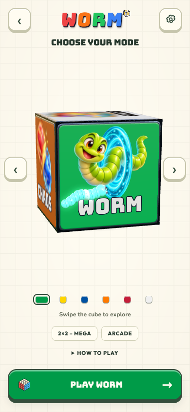

# Live cube carousel

The mode selector uses the existing physical, rotating six-face cube in the single shared WebGL canvas. The DOM stage is transparent; the paper grid is drawn behind the cube inside the scene. A measured stage rectangle fits the cube on phones, desktop and landscape, including when disclosures expand or scroll. Camera-relative presentation keeps depth visible off center.

The existing face selection, swipe/arrow controls, saved mode, animated launch dive, and mode entry flows remain. Controls use the shared typography tokens, tactile buttons, mode-colored dots and one primary action. The mode name stays on the cube rather than appearing as another heading below it.

Keyboard Enter respects disclosure summaries. Launch is blocked during the 150 ms selection transition. Cancelling WORM restores the mode selector for both Back and Escape.

## Live preview

Captured at 390×844 from the running app with the WebGL cube visible.

## Artwork

Six distinct character/object illustrations are applied as transparent decals to the existing live cube. They use rounded toy forms and a shared colorful palette. None depicts a six-faced puzzle cube or a sticker configuration.

| Mode | Image |
| --- | --- |
| WORM | Green worm curling through a turquoise portal |
| CUBE | Shallow 3×3 tile puzzle with one tile lifted from its slot |
| TEACH | Bookworm teacher with glasses and an open book |
| CHAOS | Red and blue orbs with a golden lightning bolt |
| RANDOM | Purple magician's hat with colored tiles and shuffle arrows |
| STORE | Teal treasure chest with a hat, star and colorful orbs |

Generated with the built-in image generator, one new transparent image per mode. Exact prompts are recorded in `carousel-art-prompts.json`. Original outputs were fitted without cropping to 768×768 RGBA canvases and encoded as WebP at quality 92. The application only loads these six static assets; no generation runs in the client.

The earlier reproducible geometric scenes remain in `scripts/carousel-art/model.js` as an authoring alternative, with tests for their legal cube moves. They do not describe or validate the current illustrations. `scripts/render-carousel-art.mjs` exports those scenes to `output/carousel-geometry/`, so running it cannot overwrite the current decals.
